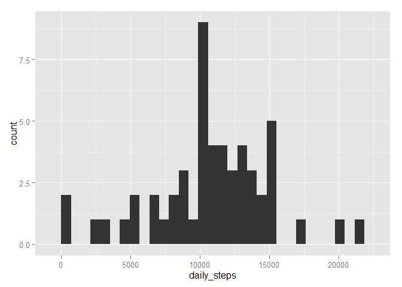
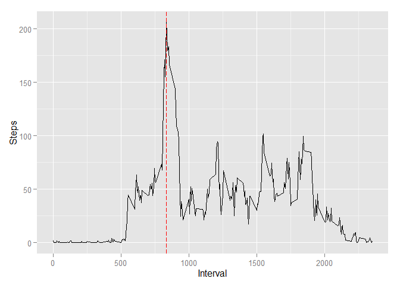
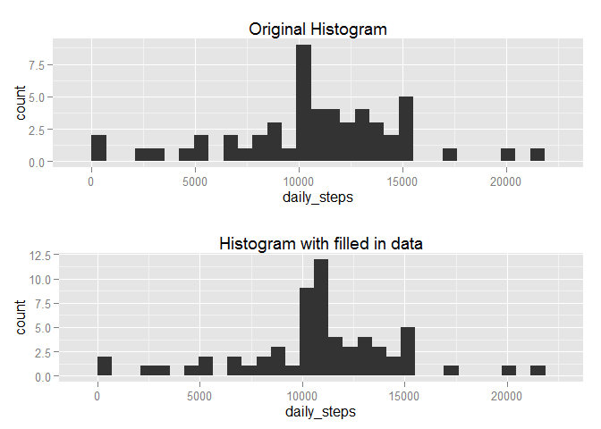
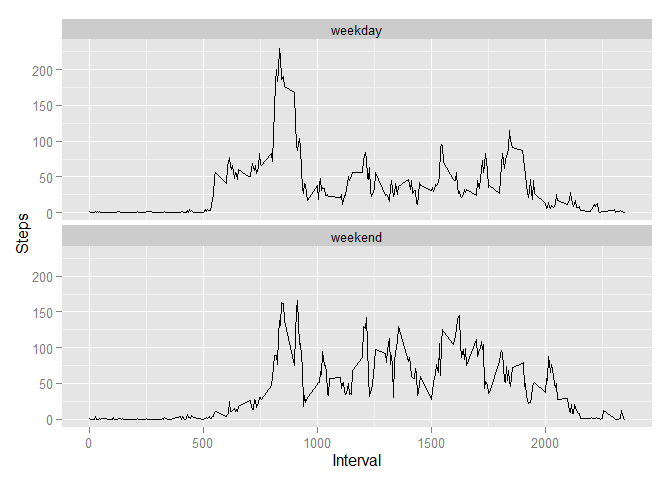

# Reproducible Research: Peer Assessment 1

Defines an utility function that loads a package, downloading it if not already installed, and loads some libraries used.


```r
usePackage <- function(p) {
  if (!is.element(p, installed.packages()[,1]))
    install.packages(p, dep = TRUE)
  require(p, character.only = TRUE)
}

usePackage("downloader")
```

```
## Loading required package: downloader
```

```r
usePackage("dplyr")
```

```
## Loading required package: dplyr
## 
## Attaching package: 'dplyr'
## 
## The following objects are masked from 'package:stats':
## 
##     filter, lag
## 
## The following objects are masked from 'package:base':
## 
##     intersect, setdiff, setequal, union
```

```r
usePackage("ggplot2")
```

```
## Loading required package: ggplot2
```

```r
usePackage("gridExtra")
```

```
## Loading required package: gridExtra
```

## Loading and preprocessing the data

1. Load the data (i.e. read.csv())


```r
  #Download data if necessary
  if (!file.exists("./repdata_data_activity.zip")) {
    download("https://d396qusza40orc.cloudfront.net/repdata%2Fdata%2Factivity.zip", dest="repdata_data_activity.zip", mode="wb")
  }
  
  if (!file.exists("./activity.csv")) {
    unzip ("repdata_data_activity.zip")
  }

  activity <- read.csv(file = "activity.csv")
  names(activity) <- c("steps","activity_date","interval")
```

2. Process/transform the data (if necessary) into a format suitable for your analysis


```r
  daily_activity <- group_by(activity,activity_date) %>% summarize(daily_steps = sum(steps)) %>% select(activity_date, daily_steps)
```

## What is mean total number of steps taken per day?

1. Make a histogram of the total number of steps taken each day


```r
  qplot(daily_steps, data=daily_activity, geom="histogram")
```

 

2. Calculate and report the mean and median total number of steps taken per day


```r
  summarize(daily_activity, steps_mean = mean(daily_steps, na.rm = T), steps_median = median(daily_steps, na.rm = T))
```

```
## Source: local data frame [1 x 2]
## 
##   steps_mean steps_median
## 1   10766.19        10765
```

## What is the average daily activity pattern?

1. Make a time series plot (i.e. type = "l") of the 5-minute interval (x-axis) and the average number of steps taken, averaged across all days (y-axis)
1. Which 5-minute interval, on average across all the days in the dataset, contains the maximum number of steps?


```r
  average_day_activity <- group_by(activity,interval) %>% summarize(interval_steps = mean(steps, na.rm = T)) %>% select(interval, interval_steps)
  
  max_steps_interval <- filter(average_day_activity, interval_steps == max(interval_steps))
  
  ggplot(average_day_activity, aes(interval, interval_steps)) + geom_line() + xlab("Interval") + ylab("Steps")  + geom_vline(xintercept = max_steps_interval[1,]$interval, colour="red", linetype = "longdash")
```

 

```r
  max_steps_interval
```

```
## Source: local data frame [1 x 2]
## 
##   interval interval_steps
## 1      835       206.1698
```

## Imputing missing values

1. Calculate and report the total number of missing values in the dataset (i.e. the total number of rows with NAs)


```r
  filter(activity, is.na(steps)) %>% summarize(na_count = n())
```

```
##   na_count
## 1     2304
```

2. Devise a strategy for filling in all of the missing values in the dataset. The strategy does not need to be sophisticated. For example, you could use the mean/median for that day, or the mean for that 5-minute interval, etc.

> average_day_activity calculated on a previous step will be used to fill missing values. This value will be rounded to the closes integer so all values are integers
  
3. Create a new dataset that is equal to the original dataset but with the missing data filled in.


```r
  activity_no_na <- left_join(activity, average_day_activity, c("interval" = "interval")) %>% 
                      mutate(no_na_steps = round(ifelse(is.na(steps), interval_steps, steps))) %>% 
                      select(steps = no_na_steps, activity_date, interval)
```

4. Make a histogram of the total number of steps taken each day and Calculate and report the mean and median total number of steps taken per day. 


```r
daily_activity_no_na <- group_by(activity_no_na,activity_date) %>% summarize(daily_steps = sum(steps)) %>% select(activity_date, daily_steps)

hist_plot <- qplot(daily_steps, data=daily_activity, geom="histogram") + labs(title = 'Original Histogram')
hist_plot_no_na <- qplot(daily_steps, data=daily_activity_no_na, geom="histogram") + labs(title = 'Histogram with filled in data')

grid.arrange(hist_plot, hist_plot_no_na, nrow=2)
```

 

```r
summarize(daily_activity_no_na, steps_mean = mean(daily_steps, na.rm = T), steps_median = median(daily_steps, na.rm = T))
```

```
## Source: local data frame [1 x 2]
## 
##   steps_mean steps_median
## 1   10765.64        10762
```

### Do these values differ from the estimates from the first part of the assignment? What is the impact of imputing missing data on the estimates of the total daily number of steps?

> The shape of the histogram, the mean and median doesn't changes much as we used the average to fill in data. The difference in the mean and median is only due to the rounding we did to make all step counts integers

## Are there differences in activity patterns between weekdays and weekends?

1. Create a new factor variable in the dataset with two levels -- "weekday" and "weekend" indicating whether a given date is a weekday or weekend day.


```r
  Sys.setlocale("LC_TIME", "English")
```

```
## [1] "English_United States.1252"
```

```r
  activity_no_na <- mutate(activity_no_na, day_type = factor(ifelse(weekdays(as.Date(activity_date)) %in% c('Sunday','Saturday'), 'weekend', 'weekday')))
```

2. Make a panel plot containing a time series plot (i.e. type = "l") of the 5-minute interval (x-axis) and the average number of steps taken, averaged across all weekday days or weekend days (y-axis). The plot should look something like the following, which was created using simulated data:


```r
  average_day_activity <- group_by(activity_no_na,day_type,interval) %>% summarize(interval_steps = mean(steps, na.rm = T)) %>% select(day_type, interval, interval_steps)
    
  ggplot(average_day_activity, aes(interval, interval_steps)) + geom_line() + xlab("Interval") + ylab("Steps")  + facet_wrap(~day_type, nrow = 2)
```

 
